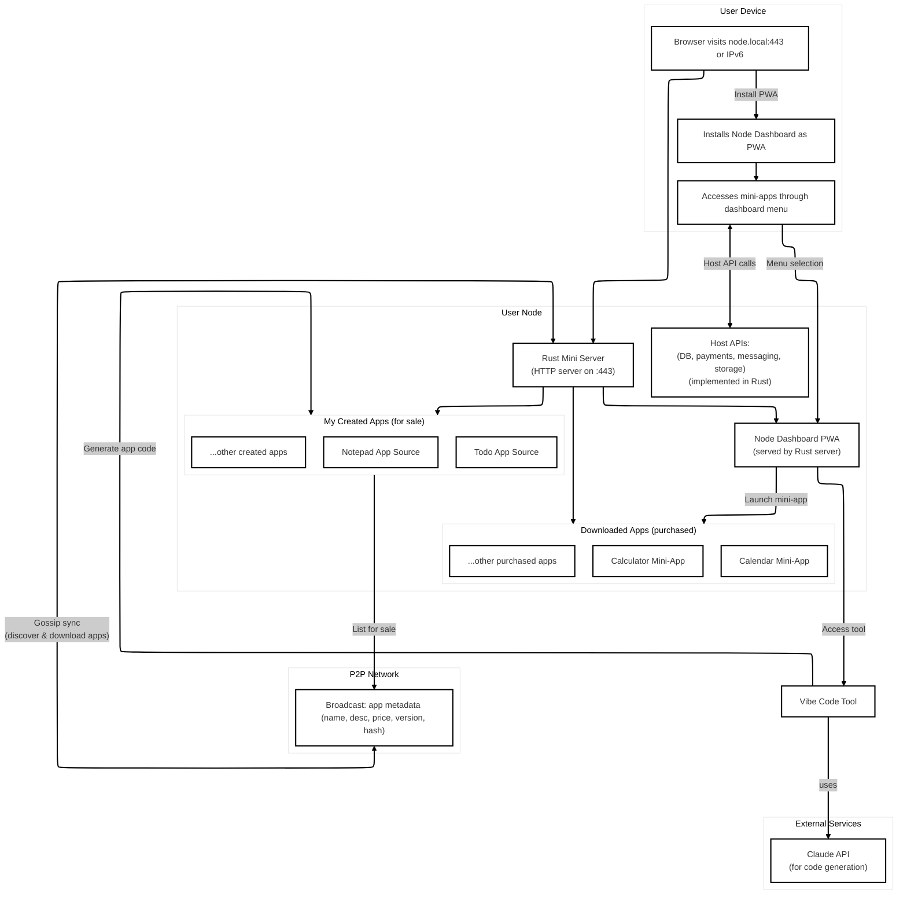

# CLAUDE.md

This file provides guidance to Claude Code (claude.ai/code) when working with code in this repository.

## Project Overview

P2P App Ecosystem - a decentralized web store where users can create, distribute, and purchase applications directly through a peer-to-peer network. Built on Bitcoin/Lightning, IPv6 (no domains), PWA architecture, L402 payments, and front-end loaded design for optimal performance on resource-constrained devices.

## Development Commands

### Frontend Development (client/)

- `pnpm dev` - Start the development server on http://localhost:5173
- `pnpm build` - Build the project (builds both main app and apps from node_modules/p2p_apps)
- `pnpm preview` - Preview the built application
- `pnpm lint` - Run ESLint to check code quality

### Rust Server Development (server/)

Navigate to the `server/` directory first:

- `cargo run` - Start the Rust mini server (default port 10000, configurable via PORT env var)
- `cargo build` - Build the project
- `cargo test` - Run tests
- `cargo check` - Fast compilation check without producing executables
- Requires `.env` file with `ANTHROPIC_API_KEY` for code generation features

### Environment Setup
- Create `.env` file in server directory with `ANTHROPIC_API_KEY=your_api_key_here`
- Optional: Set `PORT` environment variable to change server port

### Debug Mode
- `RUST_LOG=debug cargo run` - Run with detailed logging

## Architecture



## Architecture Overview

This is a **P2P App Ecosystem** project implementing a decentralized web store where users can create, distribute, and purchase applications directly through a peer-to-peer network.

### Core Components

**Frontend (TypeScript + React + Vite)** - `client/`

- Main store interface for browsing and installing apps
- Dashboard for managing installed apps
- Code generation interface for creating new apps
- Built as a PWA that can be installed locally

**Rust Mini Server** - `server/`

- HTTP server that securely proxies Anthropic API requests
- Handles code generation for new app creation
- Implements Host APIs for app functionality (database, payments, storage)
- Single-file server (`src/main.rs`) keeps backend lean - all heavy processing happens client-side

**P2P Architecture**

- Apps are distributed via gossip protocol for metadata synchronization
- Each app is self-contained with local SQLite storage
- Lightning Network integration for payments
- No central server dependencies once installed

### Key Technologies

- **State Management**: Jotai for atomic state management
- **Database**: SQLite (via sqlocal in frontend, native SQLite in backend)
- **Styling**: Tailwind CSS v4
- **Payments**: Lightning Development Kit (LDK) integration
- **P2P**: Custom gossip protocol for app metadata distribution
- **Backend Framework**: Axum web framework with Tokio async runtime

### File Structure

**Client (`client/`)**
- `src/` - Main React application source
  - `pages/` - Route components (dashboard, store, create-app)
  - `components/` - Reusable UI components
  - `libs/` - Core libraries (db, anthropic API, UI utilities)
  - `state.ts` - Global state management with Jotai
  - `router.tsx` - React Router configuration
- `public/` - Static assets
- `output/` - Build output directory
- `.claude/agents/` - Specialized agent configurations

**Server (`server/`)**
- `src/main.rs` - Single-file Rust server implementation
- `Cargo.toml` - Dependencies and configuration

### Build Configuration

- **Main Build**: Vite configuration builds the store interface
- **Apps Build**: Secondary build process compiles individual apps
- **COOP/COEP Headers**: Required for SQLite WASM functionality
- **Single File Build**: Uses vite-plugin-singlefile for distribution

### Development Patterns

**Database Operations**

- **Frontend**: Use the `db` library from `src/libs/db.ts`, subscribe to database changes via `subscribeDB` for reactive updates, SQLite runs in browser via WebAssembly
- **Backend**: Native SQLite with schema-free JSON storage, RESTful API endpoints

**State Management**

- Use Jotai atoms for reactive state
- `appsAtom` for all applications data
- `installedAppsAtom` and `storeAppsAtom` for filtered views
- `appByIdAtom` family for individual app access

**API Integration**

- Anthropic API calls must route through the Rust server
- Never expose API keys in frontend code
- Use the anthropic client from `src/libs/anthropic.ts`

**File Naming Convention**

Always use **kebab-case** for all file names in this project (e.g., `my-component.tsx`, `user-profile.md`). This applies to source files, configuration files, and documentation.

### Specialized Agents

The project includes three specialized Claude Code agents in `.claude/agents/`:

1. **p2p-app-builder** - For building P2P applications following ecosystem principles
2. **anthropic-api-integrator** - For secure API integration with proper authentication
3. **threejs-3d-ui-developer** - For 3D UI components (future Node OS integration)

Use these agents for specialized tasks within their domains.

### Security Considerations

- API keys stored in server environment variables only
- All external API calls proxied through Rust server
- Local-first data storage with user-controlled synchronization
- App signing and verification for distribution integrity

### Testing

- No specific test framework configured - check for existing test patterns before implementing
- Focus on P2P functionality testing including network partitions
- Verify offline-first behavior and Lightning payment flows

## Backend Server Details

### HTTP Server (Axum)
- **Routes**: `GET /` (health check), `POST /generate` (HTML generation)
- **CORS**: All origins allowed for decentralized access
- **State**: Shared reqwest client for Anthropic API

### AI Integration
- **Model**: Claude 3 Haiku via Messages API
- **Purpose**: Generates complete, self-contained HTML apps
- **System Prompt**: Extensive prompt engineering
- **Output**: Returns AnthropicContent with generated HTML

### Generated Applications
Creates self-contained PWA-compatible HTML with:
- Inline CSS/JavaScript (no external dependencies)
- Local storage for offline capability
- Responsive design (mobile-first, 3D UI capable)
- Interactive features using vanilla JavaScript

### Dependencies
- **axum** - Web framework
- **tokio** - Async runtime
- **serde/serde_json** - JSON serialization
- **reqwest** - HTTP client for external API calls
- **tower-http** - CORS middleware
- **tracing/tracing-subscriber** - Logging
- **dotenv** - Environment variable loading

## Host APIs

### Database API
The mini-server exposes RESTful database endpoints for P2P apps to store and retrieve data.

#### Base URL
- Development: `http://localhost:10000/api/db` 
- Production: `http://node.local:443/api/db` or IPv6 address

#### Endpoints

**List Collections**
```http
GET /api/db
```
Response:
```json
{
  "data": ["users", "posts", "settings"],
  "links": {"self": "/api/db"}
}
```

**Create Document**
```http
POST /api/db/{collection}
Content-Type: application/json

{
  "data": {
    "name": "John Doe",
    "email": "john@example.com",
    "age": 30
  }
}
```
Response:
```json
{
  "data": {
    "id": "c2e0b737-8e2c-4339-b74c-911f686aec07",
    "collection": "users",
    "data": {"name": "John Doe", "email": "john@example.com", "age": 30},
    "created_at": "2025-09-09T14:06:41.160432Z",
    "updated_at": "2025-09-09T14:06:41.160432Z"
  },
  "links": {"self": "/api/db/users/c2e0b737-8e2c-4339-b74c-911f686aec07"}
}
```

**Get Document**
```http
GET /api/db/{collection}/{id}
```

**Update Document**
```http
PUT /api/db/{collection}/{id}
Content-Type: application/json

{
  "data": {
    "name": "John Smith",
    "email": "john.smith@example.com",
    "age": 31
  }
}
```

**Delete Document**
```http
DELETE /api/db/{collection}/{id}
```
Returns: `204 No Content` on success, `404 Not Found` if document doesn't exist.

**List Documents**
```http
GET /api/db/{collection}?limit=50&offset=0
```
Response:
```json
{
  "data": [...documents...],
  "meta": {
    "count": 150,
    "limit": 50,
    "offset": 0
  },
  "links": {
    "self": "/api/db/users",
    "collections": "/api/db"
  }
}
```

#### JavaScript Integration
For P2P apps, include this helper in generated HTML:

```javascript
const HostAPI = {
  db: {
    async create(collection, data) {
      const response = await fetch(`/api/db/${collection}`, {
        method: 'POST',
        headers: {'Content-Type': 'application/json'},
        body: JSON.stringify({data})
      });
      return response.json();
    },
    
    async get(collection, id) {
      const response = await fetch(`/api/db/${collection}/${id}`);
      return response.ok ? response.json() : null;
    },
    
    async update(collection, id, data) {
      const response = await fetch(`/api/db/${collection}/${id}`, {
        method: 'PUT',
        headers: {'Content-Type': 'application/json'},
        body: JSON.stringify({data})
      });
      return response.ok ? response.json() : null;
    },
    
    async delete(collection, id) {
      const response = await fetch(`/api/db/${collection}/${id}`, {
        method: 'DELETE'
      });
      return response.ok;
    },
    
    async list(collection, limit = 100, offset = 0) {
      const response = await fetch(`/api/db/${collection}?limit=${limit}&offset=${offset}`);
      return response.json();
    },
    
    async collections() {
      const response = await fetch('/api/db');
      return response.json();
    }
  }
};

// Usage examples:
// const user = await HostAPI.db.create('users', {name: 'Alice', email: 'alice@example.com'});
// const users = await HostAPI.db.list('users', 50, 0);
// const updated = await HostAPI.db.update('users', userId, {name: 'Alice Smith'});
// const deleted = await HostAPI.db.delete('users', userId);
```

#### Features
- **Schema-free**: Store any JSON data structure
- **Auto-timestamps**: `created_at` and `updated_at` managed automatically  
- **UUID IDs**: Globally unique document identifiers
- **Pagination**: Configurable limit/offset for large datasets (max 1000 per request)
- **SQLite backend**: Low resource usage, perfect for P2P nodes
- **JSON:API format**: Standardized responses with links and metadata

## Configuration
- Server binds to `0.0.0.0:{PORT}` (default: 10000) for IPv6 compatibility
- Requires `ANTHROPIC_API_KEY` environment variable in server directory
- Optional `DATABASE_URL` (default: `sqlite:data.db`)
- Uses Claude 3 Haiku model with 4096 max tokens and temperature 1.0
- Designed for <1GB RAM constraint and peer-to-peer deployment

## Tech Stack Rationale

Our architecture reflects core principles: decentralization, privacy, and financial sovereignty.

### Bitcoin + Lightning Network
Bitcoin is the only truly decentralized blockchain at scale. Lightning enables millions of transactions per second while preserving Bitcoin's decentralization—the only credible path to global peer-to-peer digital cash.

### IPv6 + No Domains
True sovereignty means no gatekeepers. Domains require centralized registration and can be revoked. IPv6 over HTTP bypasses these systems, creating uncensorable infrastructure. IPv6 ensures scalability with virtually unlimited addresses.

### PWA (Progressive Web App)
Mobile app stores are gatekeepers with 30% taxes and censorship risk. PWAs deliver native app experience (offline, notifications, home screen) with web freedom—no permission required.

### L402 Protocol
HTTP 402 "Payment Required" was reserved 20+ years ago but unused. With Bitcoin/Lightning, L402 brings native micropayments to web protocols. Industry leaders like Coinbase and Anthropic are adopting this standard.

### Front-End Loaded Architecture
Optimized for <1GB RAM devices. Browser handles processing while server focuses on data/CRUD operations. Rust backend for performance/safety, cached frontend for speed.

### 3D UI
3D interface using Three.js feels more intuitive than 2D layouts. WebXR-compatible for VR/AR devices without vendor lock-in. Desktop/tablet default with 2D phone mode.