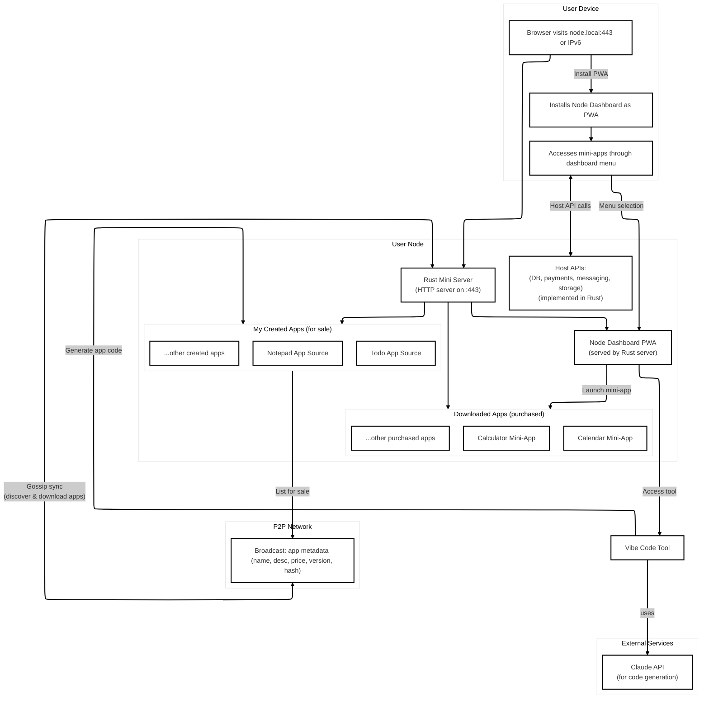

# Node

A peer-to-peer app ecosystem where users can create, distribute, and purchase applications directly through a decentralized web interface. Node represents the vision of sovereign computing - personal servers that enable true digital ownership and privacy.

## The Prototype

- The store is a **standalone `store.html` file**. Double-click to open in your default browser.
- The app list is loaded from a **dummy SQLite database** and rendered using **React**.
- Each app listing includes a **Pay button** powered by **LDK** (Lightning Development Kit).
- **AI-Powered HTML Generation**: Generate complete, interactive web applications as self-contained HTML using Claude AI.

## Architecture



- Each app is a self-contained "mini-app" served by the user's personal **Rust Mini Server**.
- Apps interact with a set of stable **Host APIs** (also implemented in Rust) for functionalities like database, payments, and storage, instead of receiving them as component props.
- The main "Node Dashboard" is a PWA that launches these mini-apps, potentially using a microfrontend-style architecture.

## Features

### Frontend (client/)
- **P2P Store Interface**: Browse and install applications from the decentralized network
- **Dashboard**: Manage installed applications and create new ones
- **Code Generation Interface**: Create new apps using AI-powered tools
- **PWA Support**: Installable progressive web app with offline capabilities
- **Lightning Payments**: Integrated Bitcoin/Lightning Network payment system

### Backend (server/)
- **AI-Powered HTML Generation**: Generate complete, interactive web applications as self-contained HTML
- **RESTful API**: Simple HTTP endpoints for code generation and data management
- **Host APIs**: Database, payments, messaging, and storage services for P2P apps
- **CORS Support**: Pre-configured for cross-origin requests
- **Environment Configuration**: Secure API key management via environment variables
- **Logging**: Built-in request tracing and error logging

## Prerequisites

- Node.js (recommended v18+)
- pnpm
- Rust (latest stable version)
- Anthropic API key

## Installation

Clone the repository:

```bash
git clone https://github.com/yourusername/node.git
cd node
```

### Frontend Setup (client/)

Install dependencies:

```bash
cd client
pnpm install
```

### Backend Setup (server/)

1. Go to the `server` directory:

   ```bash
   cd server
   ```

2. Set up environment variables:

   ```bash
   echo "ANTHROPIC_API_KEY=your_api_key_here" > .env
   ```

3. Build and run the server:

   ```bash
   cargo run
   ```

The server will start on `http://127.0.0.1:10000` by default (configurable via PORT env var) and proxy requests to the Anthropic API securely.

## Development

### Frontend Development (client/)

Start the development server:

```bash
cd client
pnpm dev
```

This will start the server on `http://localhost:5173`.

#### Debugging in VS Code

1.  Go to the "Run and Debug" view in VS Code (Shift+Cmd+D or Shift+Ctrl+D).
2.  Select "Launch Chrome against localhost" from the dropdown and click the green play button.
3.  This will automatically start the development server and open a new Chrome window connected to the debugger. You can now set breakpoints in your `.tsx` files within VS Code.

### Backend Development (server/)

#### Building
```bash
cd server
cargo build
```

#### Running Tests
```bash
cargo test
```

#### Debug Mode
```bash
RUST_LOG=debug cargo run
```

### Build

To build the frontend project:

```bash
cd client
pnpm build
```

The Node dashboard will be compiled into static resources in the `output` folder, which can then be hosted on a web server. The web server must support `COOP` and `COEP` headers. The simplest way to check this is to use the following command:

```bash
pnpm preview
```

## API Endpoints

### GET `/`
Health check endpoint that returns server status.

**Response:**
```
P2P Mini Server is running!
```

### POST `/generate`
Generate HTML applications using AI.

**Request Body:**
```json
{
  "prompt": "Create a todo list app"
}
```

**Response:**
```json
{
  "text": "<div>...generated HTML code...</div>",
  "type": "text"
}
```

### Database API (`/api/db`)
RESTful endpoints for P2P apps to store and retrieve data:

- `GET /api/db` - List collections
- `POST /api/db/{collection}` - Create document
- `GET /api/db/{collection}/{id}` - Get document
- `PUT /api/db/{collection}/{id}` - Update document
- `DELETE /api/db/{collection}/{id}` - Delete document
- `GET /api/db/{collection}` - List documents with pagination

## Usage Examples

### Generate a Todo List App
```bash
curl -X POST http://127.0.0.1:10000/generate \
  -H "Content-Type: application/json" \
  -d '{"prompt": "Create a responsive todo list with local storage"}'
```

### Generate a Calculator
```bash
curl -X POST http://127.0.0.1:10000/generate \
  -H "Content-Type: application/json" \
  -d '{"prompt": "Build a scientific calculator with history"}'
```

## Usage

Open `store.html` in your browser to use the Node dashboard. The app list will be displayed, and you can use the Pay button for each app. Access the code generation interface to create new applications using AI assistance.

## Generated Applications

The server generates complete, self-contained HTML applications that include:

- **Inline CSS**: All styling embedded within the HTML
- **Vanilla JavaScript**: No external dependencies
- **Responsive Design**: Mobile-friendly layouts
- **Local Storage**: Data persistence capabilities
- **Interactive Features**: Buttons, forms, animations, etc.
- **Host API Integration**: Access to database, payments, and storage services

### Supported Application Types

- Productivity tools (todo lists, note-takers, calculators)
- Games (puzzles, card games, simple arcade games)
- Utilities (converters, generators, timers)
- Educational tools (quizzes, flashcards, tutorials)
- Creative tools (drawing apps, text editors, color pickers)
- Data visualization tools (charts, dashboards)

## Configuration

### Environment Variables

- `ANTHROPIC_API_KEY` (required): Your Anthropic API key for Claude access
- `PORT` (optional): Server port (default: 10000)
- `DATABASE_URL` (optional): SQLite database location (default: sqlite:data.db)

### Server Configuration

- **Host**: `0.0.0.0` (IPv6 compatible)
- **Port**: Configurable via PORT env var (default: 10000)
- **CORS**: Enabled for all origins and methods

## Dependencies

### Frontend (client/)
- **React**: UI framework
- **Vite**: Build tool and dev server
- **Jotai**: Atomic state management
- **Tailwind CSS v4**: Styling framework
- **SQLite (sqlocal)**: Local database via WebAssembly
- **Lightning Development Kit**: Bitcoin/Lightning integration

### Backend (server/)
- **axum**: Web framework for HTTP server
- **tokio**: Async runtime
- **serde**: JSON serialization/deserialization
- **reqwest**: HTTP client for Anthropic API
- **tower-http**: CORS middleware
- **tracing**: Logging and observability
- **dotenv**: Environment variable loading

## Error Handling

The server provides detailed error responses for common issues:

- Missing API key configuration
- Anthropic API failures
- Invalid request formats
- Network connectivity issues
- Database connection errors

## Contributing

Pull requests are welcome. For major changes, please open an issue first to discuss what you would like to change.

## License

MIT